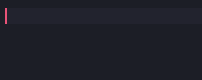

[](https://marketplace.visualstudio.com/items?itemName=draivin.hsnips)
[](https://marketplace.visualstudio.com/items?itemName=draivin.hsnips)
[](https://marketplace.visualstudio.com/items?itemName=draivin.hsnips)

# HyperSnips



HyperSnips is a snippet engine for vscode heavily inspired by vim's
[UltiSnips](https://github.com/SirVer/ultisnips).

## Usage
To use HyperSnips you create `.hsnips` files on a directory which depends on your platform:
- Windows: `%APPDATA%\Code\User\hsnips\(language).hsnips`
- Mac: `$HOME/Library/Application Support/Code/User/hsnips/(language).hsnips`
- Linux: `$HOME/.config/Code/User/hsnips/(language).hsnips`

Or alternatively, you can open this directory by running the command `HyperSnips: Open snippets
directory`.

Additionally, you can create an `all.hsnips` file for snippets that should be available on all languages.

### Snippets file
A snippets file is a file with the `.hsnips` extension, the file is composed of two types of blocks:
global blocks and snippet blocks.

Global blocks are JavaScript code blocks with code that is shared between all the snippets defined
in the current file. They are defined with the `global` keyword, as follows:
```hsnips
global
// JavaScript code
endglobal
```

Snippet blocks are snippet definitions. They are defined with the `snippet` keyword, as follows:
```hsnips
snippet trigger "description" flags
body
endsnippet
```
where the `trigger` field is required and the fields `description` and `flags` are optional.

### Trigger
A trigger can be any sequence of characters which does not contain a space, or a regular expression
surrounded by backticks (`` ` ``).

### Flags
The flags field is a sequence of characters which modify the behavior of the snippet, the available
flags are the following:

- `A`: Automatic snippet expansion - Usually snippets are activated when the `tab` key is pressed,
  with the `A` flag snippets will activate as soon as their trigger matches, it is specially useful
  for regex snippets.

- `i`: In-word expansion - By default, a snippet trigger will only match when the trigger is
  preceded by whitespace characters. A snippet with this option is triggered regardless of the
  preceding character, for example, a snippet can be triggered in the middle of a word.

- `w`: Word boundary - With this option the snippet trigger will match when the trigger is a word
  boundary character. Use this option, for example, to permit expansion where the trigger follows
  punctuation without expanding suffixes of larger words.

### Snippet body
The body is the text that will replace the trigger when the snippet is expanded, as in usual
snippets, the tab stops `$1`, `$2`, etc. are available.

The full power of HyperSnips comes when using JavaScript interpolation: you can have code blocks
inside your snippet delimited by two backticks (` `` `) that will run when the snippet is expanded,
and every time the text in one of the tab stops is changed.

### Code interpolation
Inside the code interpolation, you have access to a few special variables:
- `rv`:  The return value of your code block, the value of this variable will replace the code block
  when the snippet is expanded.
- `t`: An array containing the text within the tab stops, in the same order as the tab stops are
  defined in the snippet block. You can use it to dynamically change the snippet content.
- `m`: An array containing the match groups of your regular expression trigger, or an empty array if
  the trigger is not a regular expression.

Additionally, every variable defined in one code block will be available in all the subsequent code
blocks in the snippet.

## Examples
- Simple snippet which greets you with the current date and time
```hsnips
snippet dategreeting "Gives you the current date!"
Hello from your hsnip at ``rv = new Date().toDateString()``!
endsnippet
```

- Box snippet as shown in the gif above
```hsnips
snippet box "Box" A
``rv = '┌' + '─'.repeat(t[0].length + 2) + '┐'``
│ $1 │
``rv = '└' + '─'.repeat(t[0].length + 2) + '┘'``
endsnippet
```
